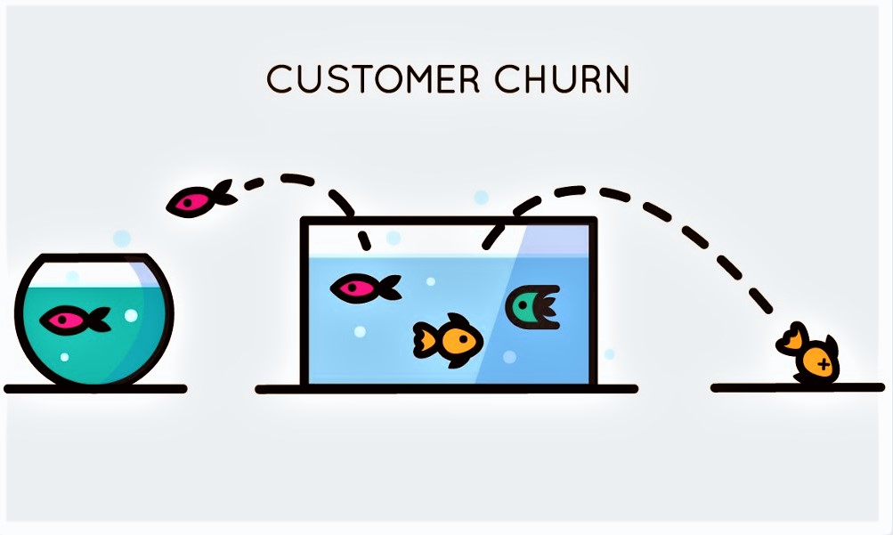
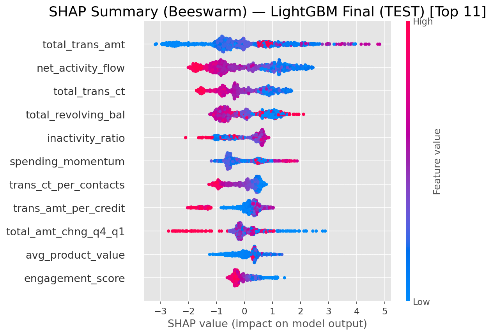

# 📉 Customer Churn Risk Prediction — Credit Card Portfolio



A machine learning project focused on predicting customer churn using behavioral and financial data, with an emphasis on business impact, risk scoring, and model interpretability.

This project demonstrates an end-to-end data science workflow — from exploratory analysis and feature engineering to model optimization, explainability, and deployment through a Streamlit application.

---

# 🧠 Business Context

Customer churn represents a significant risk for financial institutions, as losing customers directly impacts long-term revenue and customer lifetime value.

Traditional rule-based approaches often fail to capture complex behavioral patterns that precede churn. This project aims to provide a data-driven solution capable of identifying high-risk customers early, enabling proactive retention strategies.

---

# 🎯 Objective

The primary objective of this project is to:

- Predict the probability of customer churn using historical behavioral and transactional data  
- Maximize recall for churners while maintaining controlled false positives  
- Provide a risk scoring framework to support targeted retention actions  

---

# 🧭 Modeling Strategy

## Business Objective

Reduce churn by identifying as many at-risk customers as possible while maintaining operational efficiency.

## Modeling Positioning

Risk scoring model — outputs calibrated churn probabilities that can be used for prioritization and segmentation.

## Optimization Metrics

- **F2 Score** → prioritizes recall (higher cost for missed churners)  
- **PR-AUC** → robust evaluation for imbalanced datasets  

---

# 📊 Dataset Overview

- ~10,000 customers  
- Churn rate ≈ 16%  
- Rich behavioral and financial attributes  
- Multiple engagement and transaction features  


---

# ⚙️ Project Workflow

## 1️⃣ Exploratory Data Analysis

- Distribution analysis
- Univariate analysis
- Outlier validation
- Multivariate analysys  
- Behavioral segmentation    
- Correlation assessment  

## 2️⃣ Feature Engineering

Domain-driven features capturing customer behavior dynamics, including:

- Activity flow metrics  
- Engagement ratios  
- Spending momentum  
- Utilization patterns  
- Interaction effects  

## 3️⃣ Modeling

Models evaluated:

- LightGBM  
- CatBoost  
- XGBoost  
- Random Forest (baseline)  


Hyperparameter tuning performed using **Optuna** with cross-validation on training data only to avoid data leakage.

## 4️⃣ Threshold Calibration

Decision threshold selected on the validation set using constraint-aware optimization to balance recall and false positives.

## 5️⃣ Final Training

The final model was retrained on **Train + Validation datasets** to maximize the learning signal before the final test evaluation.

---

# 🏆 Final Model — LightGBM

LightGBM was selected based on overall performance, stability, and interpretability.

## 📈 Test Performance

| Metric | Value |
|------|------|
| ROC-AUC | 0.9935 |
| PR-AUC | 0.9748 |
| Recall (Churn) | 0.9568 |
| Precision (Churn) | 0.8659 |
| F2 Score | 0.9371 |

The model demonstrates strong discriminative power while maintaining high recall, aligning with the business objective of minimizing missed churners.


---

# 🔍 Model Explainability — SHAP

SHAP analysis confirms that predictions are driven by meaningful behavioral signals.

Top drivers include:

- Transaction amount  
- Activity flow  
- Transaction counts  
- Revolving balance  
- Inactivity patterns  
- Spending dynamics  

These insights reinforce the model’s alignment with real customer behavior and support trust in predictions.



---

# 💰 Estimated Business Impact

Given the dataset characteristics:

- ~10,127 customers  
- Churn rate ≈ 16%

With recall above **95%**, the model can identify the vast majority of potential churners.

Even under conservative assumptions (partial retention success and median value proxy), the model has the potential to preserve **tens of millions in customer lifetime value** by enabling proactive retention strategies.

Beyond direct revenue preservation, the model supports:

- Risk-based customer segmentation  
- Prioritization of high-value accounts  
- Efficient allocation of retention budgets  
- Integration with CRM decision workflows  

---

# 🚀 Application — Streamlit Interface

The project includes an interactive application for running predictions.

Features:

- Upload customer dataset  
- Generate churn probability  
- Risk categorization  
- Download prediction results  
- Probability distribution visualization  

Run the app locally with:

```bash
streamlit run app.py