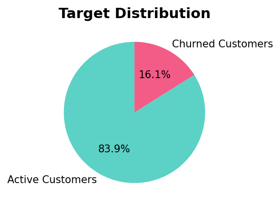
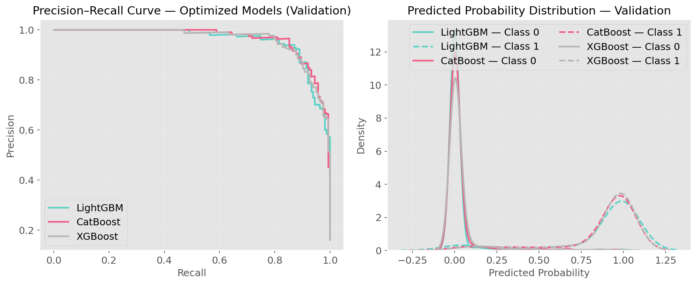
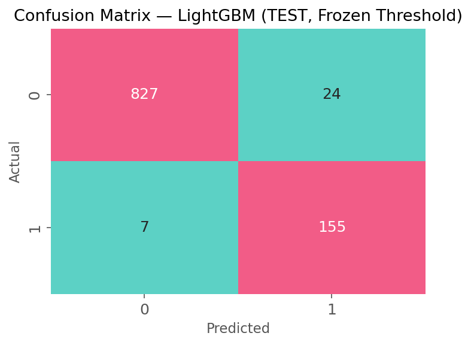

# 📉 Previsão de Risco de Churn de Clientes — Portfólio de Cartões de Crédito


Projeto de machine learning focado na previsão de churn de clientes utilizando dados comportamentais e financeiros, com ênfase em impacto de negócio, score de risco e interpretabilidade do modelo.

Este projeto demonstra um fluxo completo de data science — desde a análise exploratória e engenharia de atributos até otimização de modelos, explicabilidade e implantação por meio de uma aplicação em Streamlit.

---

# 🧠 Contexto de Negócio

O churn de clientes representa um risco significativo para instituições financeiras, pois a perda de clientes impacta diretamente a receita de longo prazo e o valor do ciclo de vida do cliente (Customer Lifetime Value).

Abordagens tradicionais baseadas em regras frequentemente falham em capturar padrões comportamentais complexos que antecedem o churn. Este projeto propõe uma solução orientada por dados, capaz de identificar clientes com alto risco antecipadamente, permitindo estratégias proativas de retenção.

---

# 🎯 Objetivo

O principal objetivo deste projeto é:

- Prever a probabilidade de churn de clientes utilizando dados históricos comportamentais e transacionais  
- Maximizar o recall para churners, mantendo controle sobre falsos positivos  
- Fornecer um framework de score de risco para apoiar ações de retenção direcionadas  

---

# 🧭 Estratégia de Modelagem

## Objetivo de Negócio

Reduzir o churn identificando o maior número possível de clientes em risco, mantendo eficiência operacional.

## Posicionamento do Modelo

Modelo de score de risco — gera probabilidades calibradas de churn que podem ser utilizadas para priorização e segmentação.

## Métricas de Otimização

- **F2 Score** → prioriza recall (maior custo para churners não identificados)  
- **PR-AUC** → avaliação robusta para datasets desbalanceados  

---

# 📊 Visão Geral do Dataset

- ~10.000 clientes  
- Taxa de churn ≈ 16%  
- Atributos comportamentais e financeiros ricos  
- Múltiplas variáveis de engajamento e transações  



---

# ⚙️ Fluxo do Projeto

## 1️⃣ Análise Exploratória de Dados

- Análise de distribuição  
- Análise univariada  
- Validação de outliers  
- Análise multivariada  
- Segmentação comportamental  
- Avaliação de correlação  

## 2️⃣ Engenharia de Atributos

Criação de variáveis orientadas ao domínio para capturar dinâmicas comportamentais, incluindo:

- Métricas de fluxo de atividade  
- Índices de engajamento  
- Dinâmica de gastos  
- Padrões de utilização  
- Efeitos de interação  

## 3️⃣ Modelagem

Modelos avaliados:

- LightGBM  
- CatBoost  
- XGBoost  
- Random Forest (baseline)  



Ajuste de hiperparâmetros realizado com **Optuna**, utilizando validação cruzada apenas nos dados de treino para evitar vazamento de dados.

## 4️⃣ Calibração de Threshold

O threshold de decisão foi selecionado no conjunto de validação utilizando otimização com restrições para equilibrar recall e falsos positivos.

## 5️⃣ Treinamento Final

O modelo final foi re-treinado com os dados de **Treino + Validação** para maximizar o aprendizado antes da avaliação final no conjunto de teste.

---

# 🏆 Modelo Final — LightGBM

O LightGBM foi selecionado com base no desempenho geral, estabilidade e interpretabilidade.

## 📈 Desempenho no Teste

| Métrica | Valor |
|------|------|
| ROC-AUC | 0.9935 |
| PR-AUC | 0.9748 |
| Recall (Churn) | 0.9568 |
| Precisão (Churn) | 0.8659 |
| F2 Score | 0.9371 |

O modelo apresenta forte capacidade discriminativa, mantendo alto recall, alinhado ao objetivo de negócio de minimizar churners não identificados.



---

# 🔍 Explicabilidade do Modelo — SHAP

A análise SHAP confirma que as previsões são guiadas por sinais comportamentais relevantes.

Principais fatores:

- Valor das transações  
- Fluxo de atividade  
- Quantidade de transações  
- Saldo rotativo  
- Padrões de inatividade  
- Dinâmica de gastos  

Esses insights reforçam o alinhamento do modelo com o comportamento real dos clientes e aumentam a confiança nas previsões.


---

# 💰 Impacto de Negócio Estimado: Cenário Conservador de Retenção

Para estimar o impacto financeiro de forma conservadora, assumimos:

- Apenas **15% dos churners identificados** são efetivamente retidos  
- O valor do cliente é estimado com base em drivers realistas de receita em um portfólio de cartões de crédito  
- Não são consideradas receitas adicionais de cross-sell, aumento de engajamento ou redução de custos  

---

## 📊 Estimativa de Valor do Cliente

Considerando que o dataset representa um portfólio de cartões de crédito, o valor do cliente foi estimado com base em duas principais fontes de receita:

### 1. Receita baseada em transações (interchange)
- Volume médio anual de transações: **~4.400 unidades monetárias**
- Taxa de interchange assumida: **~2%**
- Receita anual estimada: **~88**

### 2. Juros sobre saldo rotativo
- Saldo rotativo médio (proxy): **~1.500 unidades monetárias**
- Taxa de juros anual assumida: **~25%**
- Receita anual estimada: **~375**

### Receita total anual estimada por cliente: > **~460 unidades monetárias**
### Taxa de churn observada: > **~16%**

---

### 📊 Estimativa de Lifetime Value (LTV):
LTV ≈ Receita Anual / Taxa de Churn
> **~2.800 unidades monetárias por cliente**

---

### Impacto da Retenção

**Churners identificados:**
1.551 clientes  

**Retidos com sucesso (15%):**
1.551 × 15% ≈ **233 clientes**

## 💰 Valor Retido Estimado

233 × 2.800 ≈ **~650.000 unidades monetárias**

---

### ⚠️ Premissas Conservadoras

Esta estimativa intencionalmente:

- Utiliza premissas simplificadas para taxas de interchange e juros  
- Aproxima o valor do cliente sem decomposição completa de receita  
- Não inclui cross-sell, upsell ou aumento de engajamento  
- Não considera redução de custos operacionais  

Portanto, deve ser interpretada como uma **estimativa conservadora e de limite inferior** do impacto financeiro.

---

## 🚀 Implicações Estratégicas

Considerando:

- ~10.127 clientes  
- Taxa de churn ≈ 16%  

E um recall do modelo acima de **95%**, a solução é capaz de identificar a maioria dos clientes em risco.

Mesmo sob premissas conservadoras, o modelo possibilita:

- **Preservação de centenas de milhares em valor**
- Priorização de clientes baseada em risco  
- Alocação mais eficiente de recursos de retenção  
- Integração com fluxos de retenção via CRM  

Além do impacto financeiro direto, essa abordagem fortalece a tomada de decisão ao alinhar modelos preditivos com os reais drivers de valor do negócio.

---

# 🚀 Aplicação — Interface em Streamlit

O projeto inclui uma aplicação interativa para execução de previsões.

Funcionalidades:

- Upload de base de clientes  
- Geração de probabilidade de churn  
- Classificação de risco  
- Download dos resultados  
- Visualização da distribuição de probabilidades  

Execute a aplicação localmente com:

```bash
streamlit run app.py